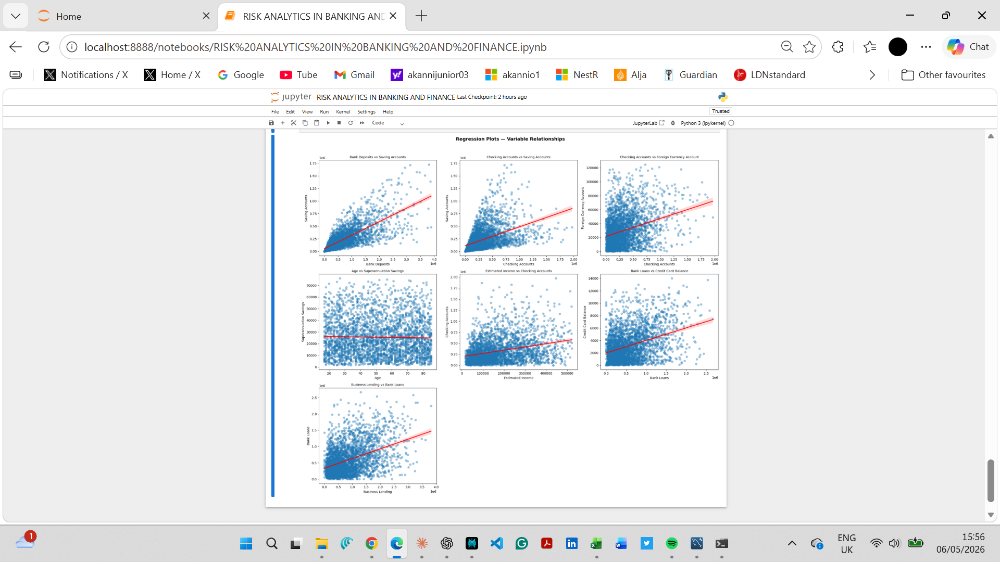
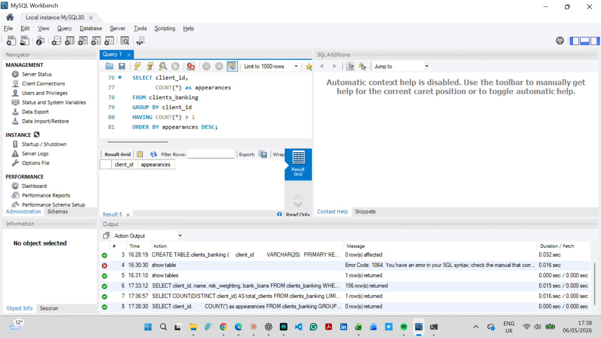
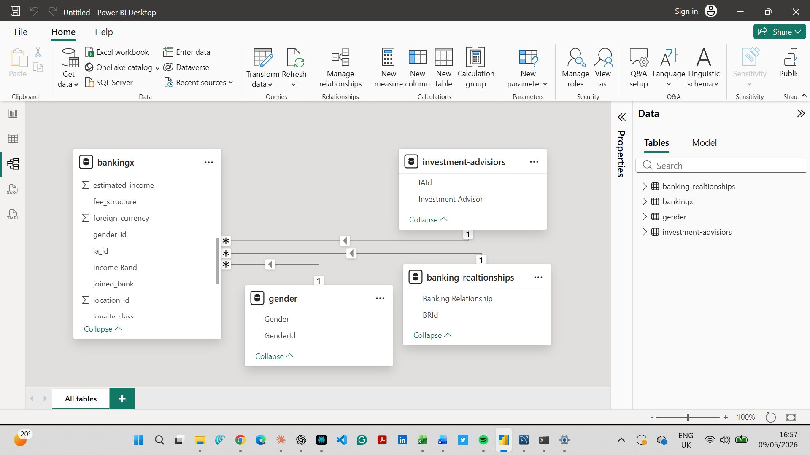
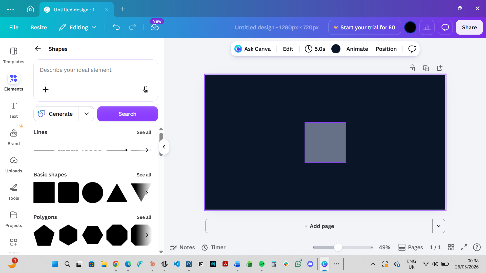
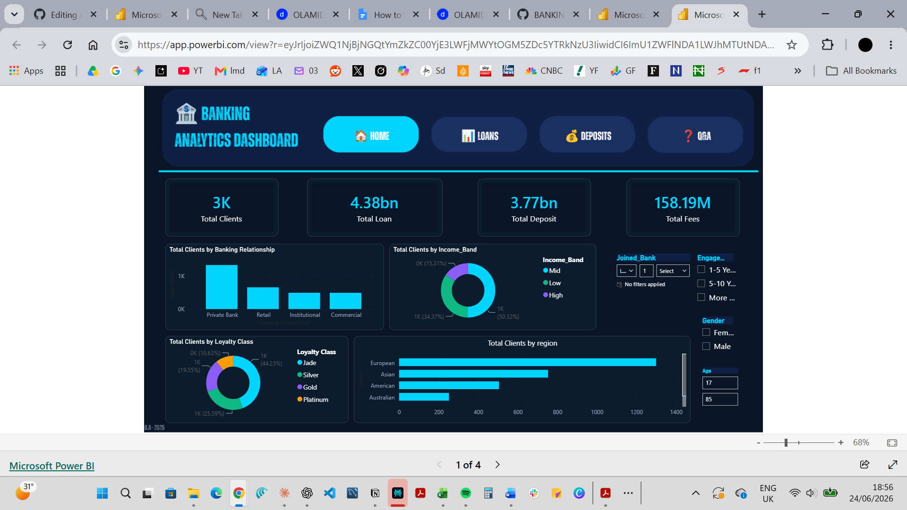
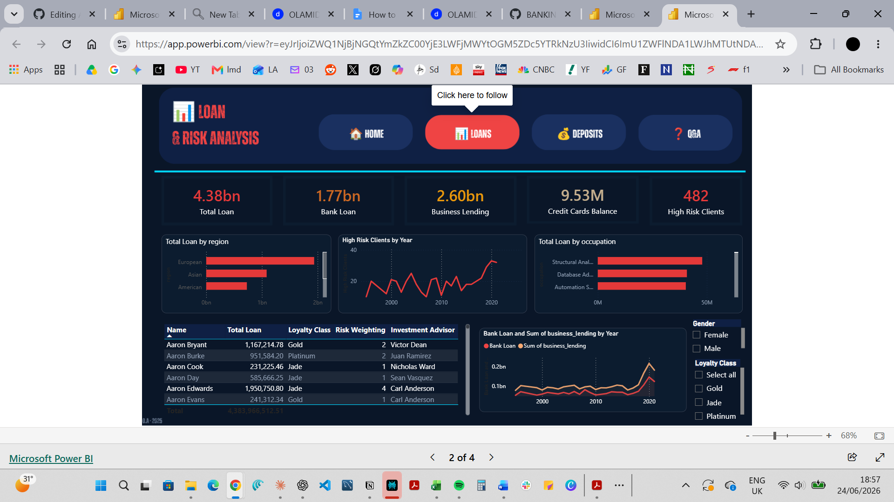
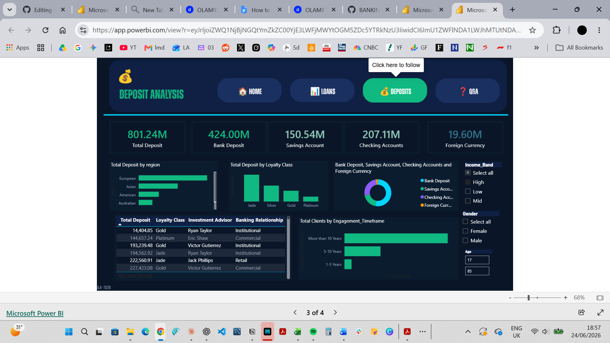
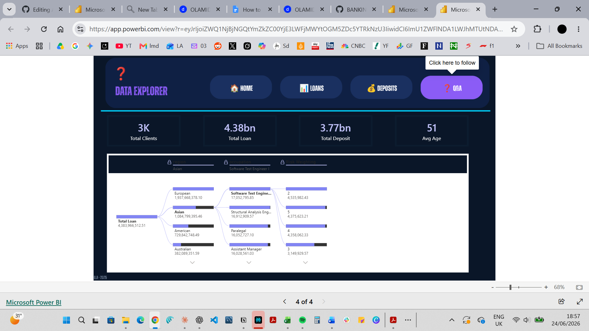

An analytics project — from raw client data to a live, interactive Power BI dashboard — covering exploratory data analysis in Python, relational database design in MySQL, data modelling and star schema in Power BI, dashboard design in Canva, and live report hosting via Power BI Service.

Tools: Python · My(SQL) · Power BI · Canva
Dataset: 3,000 banking clients · 25 financial attributes

**Project Overview**

This project started with a single question: What does a banking client portfolio actually look like beneath the surface?

With 3,000 client records and 25 financial attributes to work with, the goal was to move through every stage of the analytics pipeline — from raw data sitting in a spreadsheet, all the way to a live, interactive dashboard that a business team could open and explore on their own. No shortcuts. No skipping steps.

The pipeline runs across three tools. Python handles the initial exploration — understanding the shape of the data, finding patterns, and generating visual evidence of how variables relate to each other. MySQL takes the cleaned data and gives it proper structure, turning a flat CSV file into a relational database that can be queried in multiple directions. Power BI then connects to that database, models the relationships between tables, and transforms everything into a four-page executive dashboard hosted live on Power BI Service.

The result is a complete picture of the client portfolio — credit risk exposure, deposit behaviour, cross-sell opportunities, and loan trends — all filterable, interactive, and ready for a real business audience.

Business Questions

**The project was built to answer five core questions:**

Which client segments carry the highest credit risk, and how does that risk distribute across regions and income bands?
Where are the strongest cross-sell opportunities — clients holding loans but no deposits, or the reverse?
Which clients carry dual-lending exposure, and what is the total value of that risk?
How does income band correlate with loan uptake, business lending, and processing fee revenue?
How long are clients typically engaged with the bank, and which segments show the longest relationships?

Phase 1 — Exploratory Data Analysis in Python

Tools: Python · Pandas · Matplotlib · Seaborn · Jupyter Notebook

Before any database was designed or any dashboard was built, the data needed to be understood properly. The exploratory analysis ran inside a Jupyter Notebook titled Risk Analytics in Banking and Finance, working through the dataset systematically from top to bottom.

The first task was loading and inspecting the 3,000 client records. Missing values were identified and handled, data types were standardised across all 25 columns, and the dataset was checked for duplicates before any analysis began. Once the data was clean, the work moved into relationships between variables.

Seven regression analyses were run to examine how the key financial variables related to each other. These covered bank deposits against saving accounts, checking accounts against saving accounts, checking accounts against foreign currency holdings, age against superannuation savings, estimated income against checking account balances, bank loans against credit card balances, and business lending against total bank loans. Each pair was plotted as a scatter chart with a regression line overlaid, so the direction and strength of each relationship was visible immediately.

The regression plots told a clear story before a single SQL query was written. Business lending moved closely with total bank loans, confirming that the clients driving loan volume were the same ones accessing business credit facilities. Estimated income showed only a weak relationship with checking account balances, which suggested clients were not necessarily parking income proportionally in their accounts. Age showed almost no correlation with superannuation savings — a behavioural finding rather than an age-driven one.

These findings shaped every decision made in the phases that followed.

Phase 2 — Building the Relational Database in MySQL

Tools: MySQL Workbench · SQL

Once the exploratory work was complete, the cleaned data needed a proper home. A flat CSV file works fine for exploration, but it is not a foundation you can build reliable, multi-dimensional queries on. The data was moved into MySQL and structured as a relational database.

Opening MySQL Workbench and setting up the connection

The first step was opening MySQL Workbench and establishing a connection to the local instance. The setup used Standard TCP/IP on localhost at port 3306 — the default configuration for a local MySQL installation. With Workbench open, a new connection was configured using the Connect to Database dialog, pointing to localhost on port 3306. The connection was tested and confirmed before any schema work began.

Creating the schema and loading the data

A new schema called banking_case was created to hold all the project tables. The main client table, clients_banking, was defined with client_id as the primary key. The remaining columns were mapped to appropriate data types — VARCHAR for identifiers and categorical fields like nationality and loyalty class, numeric types for financial values, and date types for time-based columns like join date.

The cleaned CSV was loaded directly into the table, populating all 3,000 rows in a single operation. The Field Types panel in Workbench confirmed the schema structure was correct — client_id, name, age, location_id, joined_bank, banking_contact, and nationality all reading with the right types against the banking_case schema.

Writing the analytical queries

With the data in place, a series of SQL queries were written to interrogate the database from multiple angles. One specific query checked for duplicate client IDs using GROUP BY client_id HAVING COUNT(*) > 1. The result grid came back empty — zero rows — which confirmed the primary key integrity across all 3,000 records. The action output panel at the bottom tracked every execution: the table creation, the data load, the SELECT queries, and the duplicate check, with row counts and timings logged for each. By the end of this phase, the database was clean, structured, and fully queryable — ready to be connected directly to Power BI.

Phase 3 — Connecting MySQL to Power BI

Tools: Power BI Desktop · MySQL Connector

The bridge between the database and the dashboard was built through Power BI's native MySQL connector. Inside Power BI Desktop, the data import process started by selecting MySQL Database as the source, then pointing it at the local instance on localhost and selecting the banking_case schema.

Power BI pulled in all the tables from the schema in a single connection — the main bankingx fact table along with the dimension tables for investment advisors, banking relationships, and gender classifications. Each table loaded as a separate query inside Power Query Editor, where data types were reviewed and confirmed before the load completed.

Once the connection was established, refreshing the data in Power BI was as simple as clicking Refresh — the dashboard would pull the latest state of the database automatically, making the pipeline repeatable and maintainable.

Phase 4 — Data Modelling and Star Schema

Tools: Power BI Desktop — Model View

Once the tables were loaded, the relationships between them needed to be defined. This was done inside Power BI's Model View, where the tables were arranged and connected to form a proper star schema.

The bankingx table — the main fact table — sat at the centre, holding the transactional and financial data for all 3,000 clients. Three dimension tables connected out from it: gender on GenderId, investment-advisors on IAId, and banking-realtionships on BRId. Each relationship was set as a one-to-many link, with the dimension table on the one side and the fact table on the many side — the correct structure for a star schema that allows filters to flow cleanly from dimension to fact.

Getting this structure right before building any visuals was important. A correctly defined model means that when a user selects a gender or banking relationship filter on the dashboard, that filter flows through the relationships and updates every visual on the page simultaneously — without any manual workarounds or calculated columns to compensate for a broken model.

Phase 5 — Dashboard Design with Canva

Tools: Canva

Before visuals were placed in Power BI, the dashboard layout was designed in Canva first. This step is often skipped, and it shows in the output — dashboards built without a design foundation tend to look like a collection of visuals dropped wherever there was space.

The Canva work established the colour palette, the dark navy background theme, the navigation bar layout with pill-shaped buttons for Home, Loans, Deposits, and Q&A, the KPI card positions across the top of each page, and the overall visual hierarchy. The canvas size was set to 1280 x 720 pixels to match the Power BI report page dimensions exactly.

The finished background for each page was exported as a PNG and imported into Power BI as the canvas background. Every Power BI visual was then placed on top of this background, aligned to the grid that had been established in the design stage. The result was a dashboard that looked intentionally designed rather than assembled on the fly.

Phase 6 — Building the 4-Page Interactive Dashboard

Tools: Power BI Desktop · DAX

With the data modelled and the design backgrounds in place, the dashboard was built page by page. Each page was given a specific analytical focus, a consistent set of interactive filters, and cross-page navigation through the button bar at the top.

Before placing visuals, the core DAX measures were written: SUMX for weighted loan and deposit totals, DISTINCTCOUNT for unique client counts, CALCULATE with FILTER for segment-level isolation such as high-risk clients, DATEDIFF for engagement duration calculations, and SWITCH for dynamic income band classification.

Page 1 — Banking Analytics Dashboard (Home)

The home page opens with four KPI cards running across the top: 3K total clients, 4.38bn total loan, 3.77bn total deposit, and 158.19M total fees. Below the cards, the page breaks down the client base by banking relationship type across Private Bank, Retail, Institutional, and Commercial segments; by income band across High, Mid, and Low; by loyalty class across Jade, Silver, Gold, and Platinum; and by region across European, Asian, American, and Australian. A filter panel on the right lets users slice the whole page by join year, engagement timeframe, gender, and age range.

Page 2 — Loan and Risk Analysis

The loans page focuses entirely on credit exposure. Five KPI cards across the top show total loan at 4.38bn, bank loan at 1.77bn, business lending at 2.60bn, credit cards balance at 9.53M, and high-risk clients at 482. Three charts occupy the centre of the page: total loan by region as a horizontal bar chart showing European clients carrying the largest exposure, high-risk clients by year as a line chart tracking the trend from 2000 to 2020, and total loan by occupation. Below these sits a detailed client-level table showing each client's name, total loan value, loyalty class, risk weighting, and assigned investment advisor. A secondary time-series chart on the right tracks bank loans against business lending year by year.

Page 3 — Deposit Analysis

The deposits page mirrors the loans page in structure but focuses on the liability side of the portfolio. Five KPI cards across the top show total deposit at 801.24M broken into bank deposit at 424.00M, savings account at 150.54M, checking accounts at 207.11M, and foreign currency at 19.60M. Charts on this page show total deposit by region, total deposit by loyalty class across Jade, Silver, Gold, and Platinum, and a donut chart breaking down the product mix across all four deposit types. A client engagement timeframe chart on the right shows how long clients have been active, grouped into 1-5 years, 5-10 years, and more than 10 years. A detailed table beneath shows individual client deposit values alongside their loyalty class, investment advisor, and banking relationship.

Page 4 — Data Explorer

The fourth page is built around a decomposition tree visual that lets users drill into the total loan portfolio of 4.38bn from any angle they choose. Starting from the total, the tree can be expanded by region first — European clients at 1.94bn, Asian at 1.08bn, American at 730M, Australian at 382M — and then further drilled by occupation and risk weighting. The decomposition tree recalculates in real time as the user selects each path, making it possible to answer questions that were never anticipated when the dashboard was first designed. Four summary KPI cards at the top show total clients, total loan, total deposit, and average age across the filtered selection.

Phase 7 — Publishing to Power BI Service
Tools: Power BI Service 

Once the dashboard was complete in Power BI Desktop, it was published to Power BI Service to make it accessible as a live hosted report. Publishing converted the .pbix file into a report that any authorised user can open directly in a browser — no Power BI Desktop installation required on their end.

The live report on Power BI Service preserves every piece of interactivity built into the desktop version. Every filter panel, every cross-visual highlight, every decomposition tree drill-down, and every navigation button works exactly as built. The report is currently hosted at the link below.

View the Live Dashboard on Power BI Service - [LINK](https://app.powerbi.com/view?r=eyJrIjoiZWQ1NjBjNGQtYmZkZC00YjE3LWFjMWYtOGM5ZDc5YTRkNzU3IiwidCI6ImU1ZWFlNDA1LWJhMTUtNDA0Yy05MTA2LWRkNGRhNzlhOWNjNiJ9) 

**Key Findings**

**The total loan portfolio across 3K clients stands at 4.38bn, with European clients carrying the largest share by region at 1.94bn.
482 clients were flagged as high risk — a segment that shows a rising trend in the years approaching 2020, warranting closer monitoring from investment advisors.
Business lending of 2.60bn exceeds bank loans of 1.77bn, with a sharp upward trend in business lending visible in the time-series chart from 2015 onwards.
The deposit portfolio totals 801.24M, with bank deposits making up the largest share at 424M and foreign currency holdings the smallest at 19.60M.
The majority of clients sit in the mid income band, which also accounts for the largest share of total loan uptake across the portfolio.
Engagement timeframe data shows that the largest portion of the client base has been with the bank for more than 10 years, indicating strong retention in the core portfolio.**

---
**Skills**

Python · Pandas · Matplotlib · Seaborn · Jupyter Notebook · MySQL · SQL · Multi-Table Joins · Relational Schema Design · Data Cleaning · Exploratory Data Analysis · Power BI · DAX · Star Schema · Data Modelling · Power Query · KPI Dashboard Design · Canva · Business Intelligence · Data Storytelling · Power BI Service

---

## Connect:

OLAMIDE AKANNI

---

Feedback welcome!
